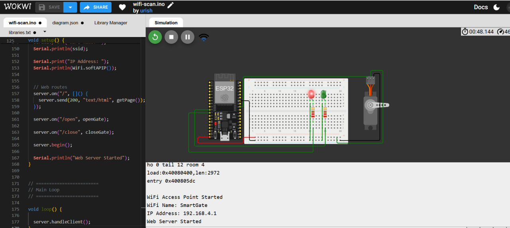
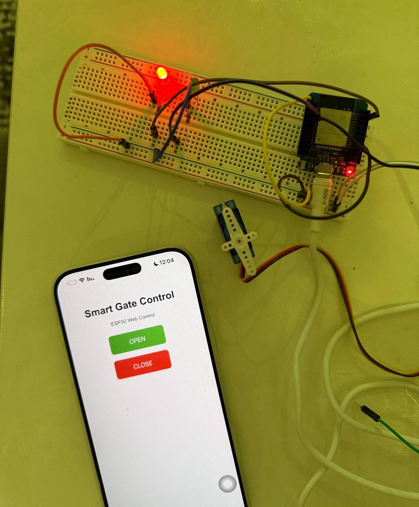

<div align="center">

# 🌐 ESP32 Web Servo Control

### Wi-Fi Access Point • Web Interface • Servo Control • LED Indicators

A web-controlled servo system built with the **ESP32**, allowing users to control a servo motor directly from a browser through a local Wi-Fi Access Point.

<br>


</div>

---

## 📌 Project Overview

This project demonstrates how an **ESP32** can operate as a Wi-Fi Access Point and host a simple web interface for controlling a servo motor.

The user connects directly to the ESP32 network and accesses a control page containing two commands:

- 🟢 **OPEN** — moves the servo to the open position.
- 🔴 **CLOSE** — returns the servo to the closed position.

Two LEDs provide visual feedback about the current system state.

The project was first simulated using **Wokwi** and then implemented on physical hardware.

---

## ✨ Features

- 📡 ESP32 configured as a **Wi-Fi Access Point**
- 🌐 Local **web-based control interface**
- ⚙️ Servo motor control through the browser
- 🟢 Green LED indicates the **OPEN** state
- 🔴 Red LED indicates the **CLOSED** state
- 🧪 Wokwi simulation
- 🔧 Physical hardware implementation
- 📱 Control from a smartphone or computer without requiring Internet access

---

##  Components

| Component | Quantity |
|:---|:---:|
| ESP32 Board | 1 |
| Servo Motor | 1 |
| Green LED | 1 |
| Red LED | 1 |
| 220 Ω Resistors | 2 |
| Breadboard | 1 |
| Jumper Wires | As needed |

---

## 🔌 Pin Configuration

| Component | Connection | ESP32 Pin |
|:---|:---|:---:|
| Servo Motor | Signal | GPIO 18 |
| Green LED | Signal | GPIO 26 |
| Red LED | Signal | GPIO 27 |
| Servo Motor | VCC | 5V |
| Servo Motor | GND | GND |
| LEDs | GND | GND |

---

## 🧠 System Architecture

```text
             📱 Smartphone / 💻 Computer
                         │
                         │ Wi-Fi
                         ▼
              ┌────────────────────┐
              │       ESP32        │
              │   Access Point     │
              │   + Web Server     │
              └─────────┬──────────┘
                        │
             ┌──────────┼──────────┐
             │          │          │
             ▼          ▼          ▼
          ⚙️ Servo    🟢 LED     🔴 LED
             │
             ▼
        OPEN / CLOSE
```

---

## ⚙️ How It Works

### 1️⃣ ESP32 Access Point

When the ESP32 starts, it creates its own local Wi-Fi network:

```cpp
const char* ssid = "ESP32_Access_Point";
const char* password = "12345678";
```

The user connects a smartphone or computer directly to this network.

---

### 2️⃣ Web Interface

The ESP32 runs a local web server that provides two controls:

<div align="center">

### 🟢 OPEN &nbsp;&nbsp;&nbsp; 🔴 CLOSE

</div>

Pressing either button sends a request to the ESP32, which updates the servo position and LED indicators.

---

### 3️⃣ OPEN Command

When **OPEN** is selected:

```text
Servo Motor  → 90°
Green LED    → ON
Red LED      → OFF
```

The servo rotates to represent the gate opening.

---

### 4️⃣ CLOSE Command

When **CLOSE** is selected:

```text
Servo Motor  → 0°
Green LED    → OFF
Red LED      → ON
```

The servo returns to its original position.

---

## 🔄 Control Flow

```text
Start
  │
  ▼
Initialize ESP32
  │
  ▼
Create Wi-Fi Access Point
  │
  ▼
Start Web Server
  │
  ▼
User Opens Control Page
  │
  ├──────── OPEN ────────► Servo 90°
  │                       Green ON
  │                       Red OFF
  │
  └──────── CLOSE ───────► Servo 0°
                          Green OFF
                          Red ON
```

---

## 📡 Network Configuration

| Parameter | Value |
|:---|:---|
| Wi-Fi Mode | Access Point (AP) |
| Network Name | `ESP32_Access_Point` |
| Password | `12345678` |
| Control Method | Local Web Server |
| Internet Required | No |

> The ESP32 creates a local wireless network, so the control interface can operate without an external router or Internet connection.

---

## 🧪 Wokwi Simulation

The circuit and control logic were first tested using **Wokwi** before implementation on the physical ESP32.

<p align="center">
  
</p>

<p align="center">
  <i>ESP32 servo and LED control simulation in Wokwi.</i>
</p>

---

## 🔧 Hardware Implementation

After simulation, the circuit was implemented using the physical ESP32 board, servo motor, LEDs, resistors, and breadboard.

<p align="center">
  
</p>

<p align="center">
  <i>Physical implementation of the ESP32 web-controlled servo system.</i>
</p>

---

## 🎥 Demo

### 💻 Wokwi Simulation

[▶️ View Wokwi Simulation Demo](demos/wokwi-demo.mp4)

### 🔧 Hardware Demo

[▶️ View Hardware Implementation Demo](demos/hardware-demo.mp4)

---

## 📂 Repository Structure

```text
esp32-web-servo-control/
│
├── 📄 README.md
│
├── 💻 code/
│   └── esp32_web_servo_control.ino
│
├── 🖼️ images/
│   ├── wokwi-simulation.png
│   └── hardware-implementation.jpg
│
└── 🎥 demos/
    ├── wokwi-demo.mp4
    └── hardware-demo.mp4
```

---

## 💻 Source Code

The complete ESP32 program is available here:

➡️ [`code/esp32_web_servo_control.ino`](code/esp32_web_servo_control.ino)

The program handles:

- Wi-Fi Access Point creation
- Web server initialization
- OPEN/CLOSE HTTP requests
- Servo positioning
- LED status control

---

## ✅ Results

The completed system successfully demonstrates:

✔ ESP32 operation as a Wi-Fi Access Point  
✔ Browser-based servo control  
✔ OPEN and CLOSE gate positions  
✔ LED-based state indication  
✔ Local control without Internet access  
✔ Simulation and physical implementation

---

## 🚀 Possible Improvements

The project can be extended in the future by adding:

- 🔐 Web interface authentication
- 📏 Ultrasonic vehicle detection
- 📱 Improved mobile interface
- 🚦 Additional gate status indicators
- 🔄 Real-time gate status on the webpage

---

<div align="center">

### ESP32 Web Servo Control

**Embedded Systems • IoT • Web Control**

</div>
